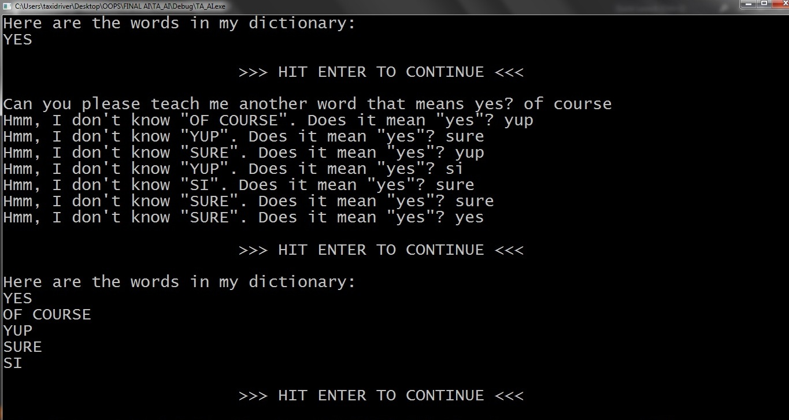

this program is an interactive dictionary that identifies and can learn synonyms for the word "Yes" that are stored in, read from and written to a disk file. The program understands NO, and there are also a number of features for controlling bad data, repetitive synonyms and storing multiple synonyms at once. 

